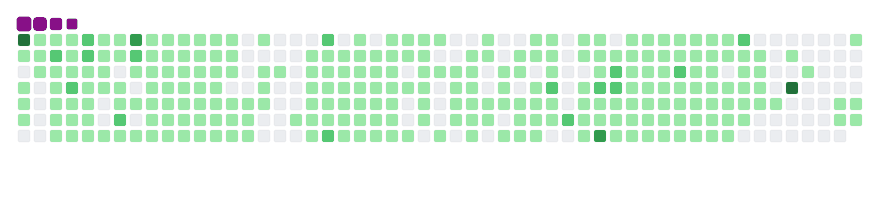

### Hi! Welcome to My Github Profile 👋

- 🔭 I’m currently working on Java                                                                           
- 🌱 I’m currently learning (QA) Full Stack Automation Engineering
- 💪 2022 goals: Learn to code. ✨ To bring out quality projects.
- ⚡ Fun fact: I love reading 📖, painting 🖌️, taking pictures 📷 and coding. 💻
- 📫 

⏲ What we are doing now:
I am learning Java 🚀. I am learning programming from different sources 📃. I am improving myself.

