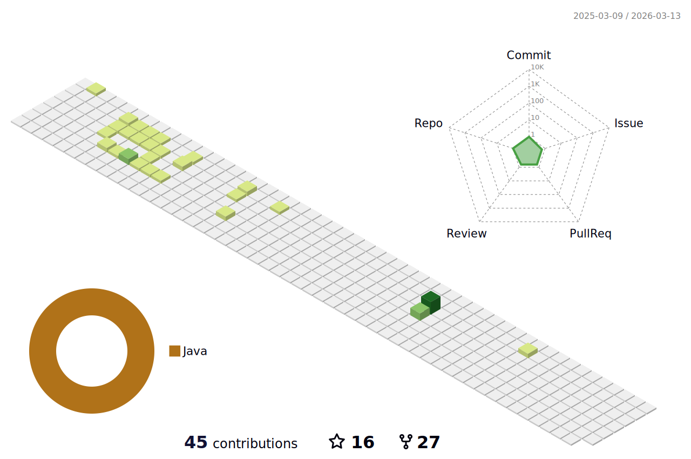

### Hi! Welcome to My Github Profile 👋

- 🔭 I’m Software Automation Engineer                                                                           
- 🌱 I'm working on a project with framework TestNG and Cucumber
- 🌱 I'm instructor on Selenium, SQL and GitGithub
- 💪 Fun fact: I love coding 💻
- ⚡ writing blog 🖋️, football ⚽ and playing guitar 🎸. 
- ⏲ What we are doing now: i am writing code 🚀.
 
&nbsp;&nbsp;&nbsp;	

