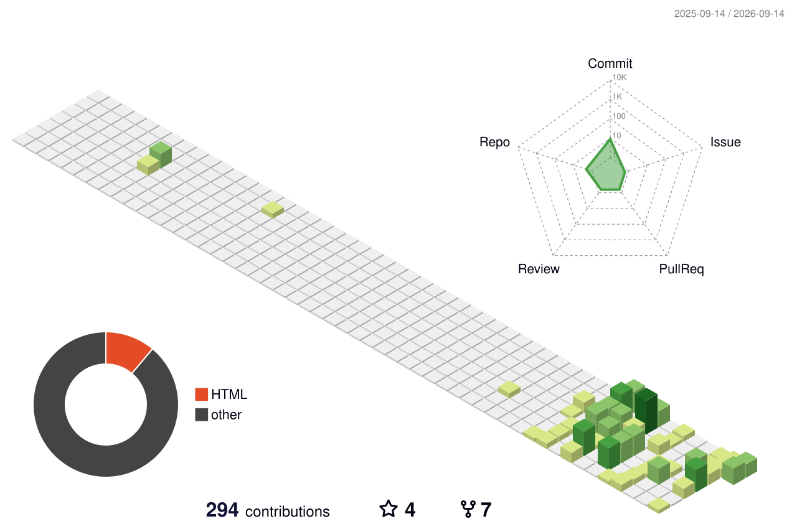

  

# Hi there, I'm Erol Evren! 👋

  

### 🛠️ About Me

Detail-oriented **Software Quality Assurance Engineer** with 5+ years of experience in designing, developing, and executing end-to-end automated testing solutions for web, mobile, and API platforms.

- 🌱 **Instructor & Mentor:** Java, Selenium, SQL/JDBC, API (Postman/RestAssured), Appium, and Git/GitHub

---

### 🌐 Connect with Me

  
  
  

---

### 🧰 Tech Stack & Tools *(Tıklayarak resmi sitelerine gidebilirsiniz)*

#### **Automation Frameworks**

  
  
  
  

#### **Languages**

  
  
  

#### **API & Performance Testing**

  
  
  
  

#### **CI/CD & DevOps**

  
  
  
  

#### **Test Management**

  
  

---

### 📊 GitHub Stats & Activity

  
  

