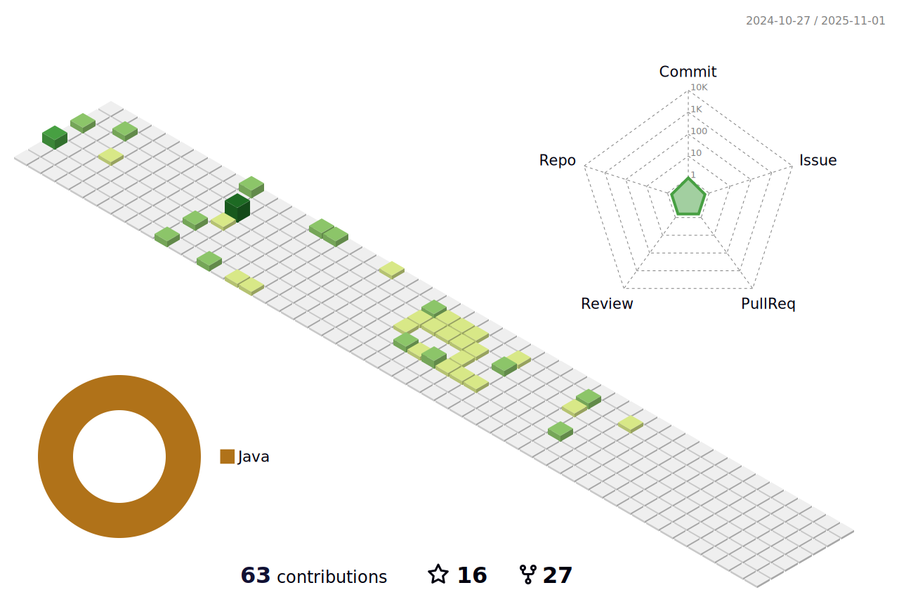

### Hi! Welcome to My Github Profile 👋

- 🔭 I’m Full Stack Automation Engineer                                                                            
- 🌱 I'm working on a project with framework TestNG and Cucumber
- 💪 2022 goals: To bring out quality projects.
- ⚡ Fun fact: I love coding 💻, writing blog 🖋️, football ⚽ and playing guitar 🎸. 
- ⏲ What we are doing now: i am writing code 🚀.
 
&nbsp;&nbsp;&nbsp;	

                                                                                                                                     
   

